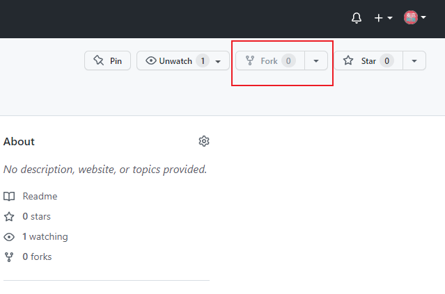
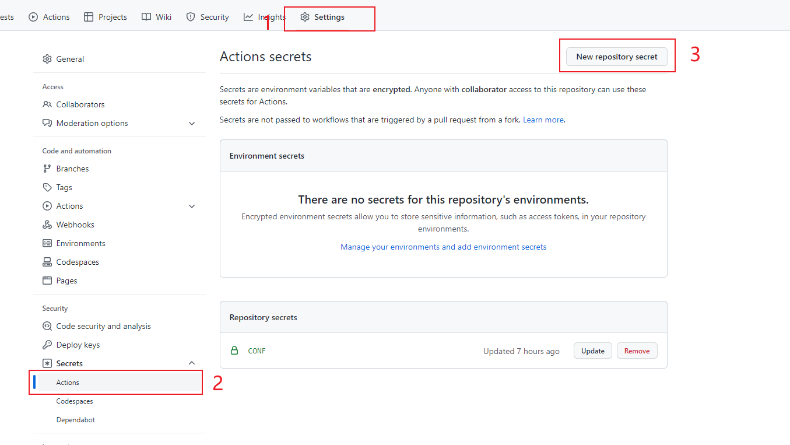
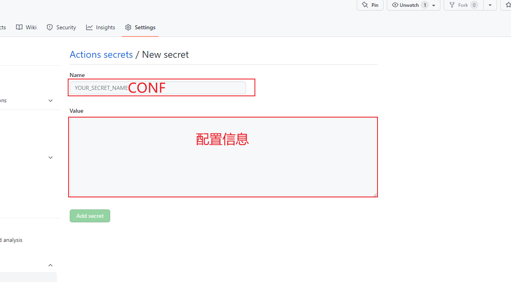
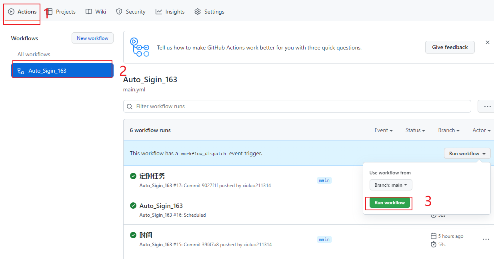
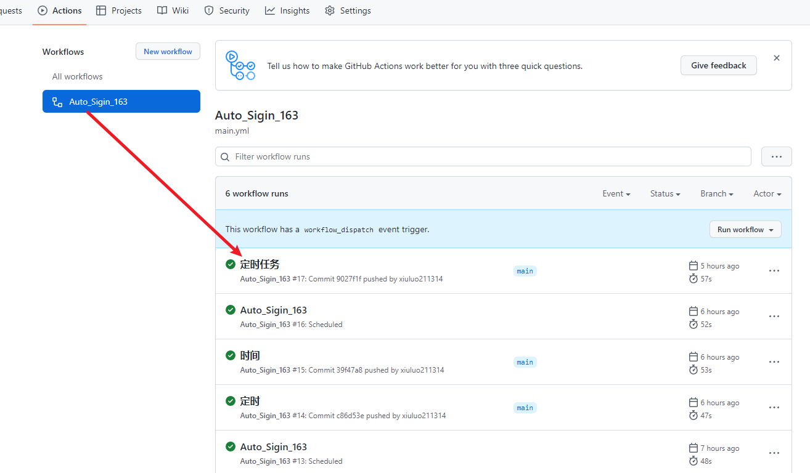
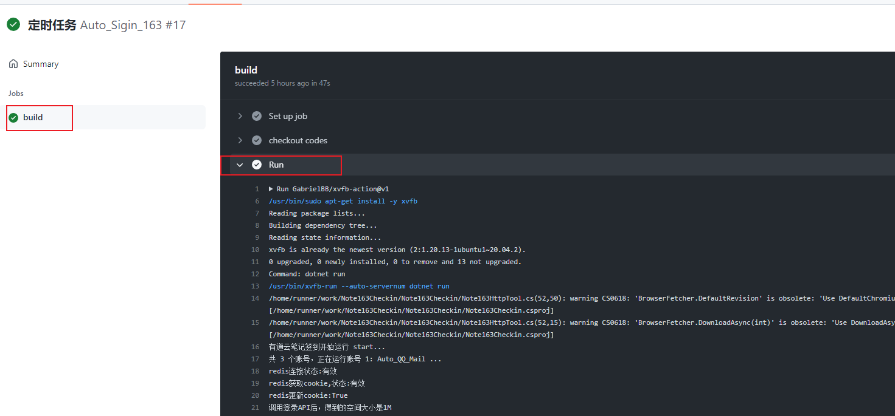

<div align="center">
  
  <h1>Note163Checkin</h1>
  <blockquote>基于Github Actions的有道云笔记每日签到</blockquote>
</div>

<div align="center">
  <a href="https://github.com/xiuluo211314/Note163Checkin/issues"></a>
  <a></a>
  <a></a>
  <a></a>
</div>

## 说明
本项目是基于**Github Actions**的有道云笔记`每日定时任务`**签到**（主要重写了项目[Note163Checkin](https://github.com/BlueHtml/Note163Checkin) ）。涉及到API包括，登录接口、签到接口、看广告接口、看广告视频接口，每日可**新增30M**+存储空间，签到数据信息可配置通过**MySql**存储下来。

---
## 注意

* 重写项目[Note163Checkin](https://github.com/BlueHtml/Note163Checkin)，对原作者表示感谢
* 涉及到Redis，可使用[redislabs](https://app.redislabs.com/)的免费套餐。
  
## 视频教程
* 待完善


## 安装
#### 1. Fork仓库
使用`GitHub`账户登录后，点击右上角的`Fork`到仓库中
<!--  -->


<br>

#### 2. 添加Secret

**`Settings`->`Secrets`->`New repository  secret`，添加名称为`CONF`的Secret：**

- CONF配置参考如下：
    ```json
   {
		"Users": [{
				"Task": "CC", //自定义名字，选填
				"Username": "abc@163.com", //账号
				"Password": "aaa" //密码
			},{
				"Task": "CC_1",
				"Username": "abcd@163.com", 
				"Password": "bbb"
			}
		],
		"ScKey": "", //server酱sckey，不填不开启
		"ScType": "", //通知类型. Always:始终通知; Failed:失败时通知; 不填/其他:不通知;
		"RdsServer": "", //redis地址，选填
		"RdsPwd": "", //redis密码，选填
		"MySqlServer": "", // MySql数据库host,选填
		"MysqlUserName": "", //数据库账户,选填
		"MySqlPwd": "", // 数据库密码,选填
		"MySqlDatabase": "" // 数据库,选填
	}
    ```
    1. 支持`多账号`签到
    2. `RdsServer`和`RdsPwd`是选填的，用于配置redis，来存储cookie。后续可以重用这个cookie，避免频繁登录账号。建议配置一下，可以使用[redislabs](https://app.redislabs.com/)的免费套餐。
    3. 支持`MySql`数据存存储数据，建表语句见[AUTO_RECORD_INFO](./images/AUTO_RECORD_INFO.sql)
<br>

- 步骤图示如下：
  
  
<br>

#### 3. 运行Action

**`Actions`->`Auto_Sigin_163(CONF中的NAME)`->`Run workflow`**：


**注意**：
1. 本项目已经设置**自动运行**，详情见文件[.github/workflows/main.yml](./.github/workflows/main.yml)。
	> schedule: <br>
    	 &nbsp;&nbsp;&nbsp;&nbsp;-- cron: '30 1,6 * * *' # 每天9:30, 14:30执行，时间为国际标准时间 + 8 =北京时间！！
2. 目前执行Action有三种方式：
	> push代码执行(已注释)<br>
	> workflow手动执行<br>
	> 定时任务

<br>


#### 4. 查看运行结果

**`Actions`->`Auto_Sigin_163(CONF中的NAME)`->`build`**，能看到下图，表示运行成功
<!--  -->



## 发电

如果您觉得有用的话，欢迎来**捐赠**，请`阿洛`喝杯饮料！大家的支持就是我继续开源的动力哟~！

WeChat & Alipay：


## 注意事项

24小时内频繁登录可能会触发验证，程序就会登录失败。此时需要在网页上手动登录一次（需要输入验证码），登录成功后再次运行本程序即可。

## 参考

主要参考了以下项目，并重写了代码：
- [Note163Checkin](https://github.com/BlueHtml/Note163Checkin) 再次衷心感谢
